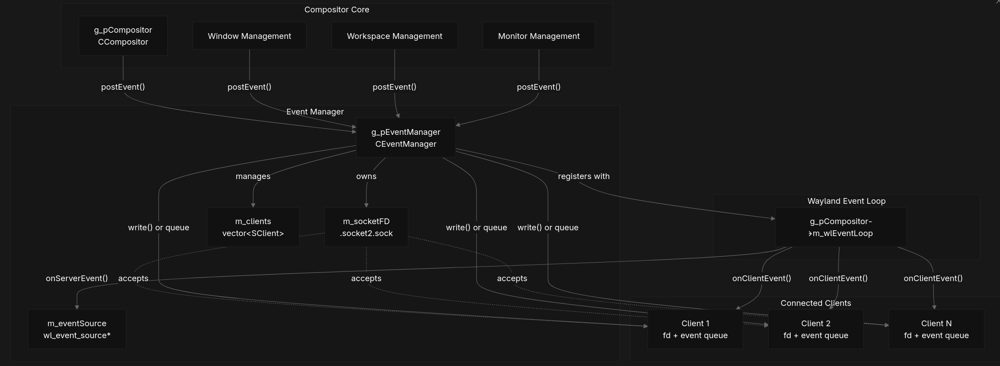

# How to get the data ?
How to get the data about which screen is in focus right now as I would need that to track active screen.

But let's first see what configuration I have on my system as answers might (will) change depending on the OS and DSP.

## Configuration
- OS -> Linux archlinux 6.12.61-1-lts
- Window Manager -> Hyprland
- Display Server Protocol -> wayland

### hyprctl

I found something called `hyprctl`. hyprctl is an utility for controlling some parts of the compositor from a CLI or a script.

```bash
hyprctl clients
```

I can use this command to list all the details about all the rendered windows.
Example:

```
Window 5f45642baf10 -> 02-who-renders-windows.md - vats - Visual Studio Code:
	mapped: 1
	hidden: 0
	at: 1926,6
	size: 2548,1428
	workspace: 2 (2)
	floating: 0
	pseudo: 0
	monitor: 1
	class: code
	title: 02-who-renders-windows.md - vats - Visual Studio Code
	initialClass: code
	initialTitle: Visual Studio Code
	pid: 11568
	xwayland: 0
	pinned: 0
	fullscreen: 1
	fullscreenClient: 1
	grouped: 0
	tags: 
	swallowing: 0
	focusHistoryID: 1
	inhibitingIdle: 0
	xdgTag: 
	xdgDescription: 
```

So the first Idea I got was to poll this data every second to know which screen is at focus and then keep track.
But I got to know that this is not the right way as hyprland pulishes such events and subscribing to such events is much more robust way rather than collecting logs by polling.

### socat

This is a linux tool that stands for SOcket CAT. It is to sockets what `cat` is to files.

```bash
socat - UNIX-CONNECT:$XDG_RUNTIME_DIR/hypr/$HYPRLAND_INSTANCE_SIGNATURE/.socket2.sock
```

Output
```
activewindow>>kitty,~
activewindowv2>>63890ec39f30
activewindow>>kitty,htop
activewindowv2>>63890ea297e0
activewindow>>kitty,~
```

It simply :
- Opens a socket
- Print whatever flows through

I also need to understand what a `socket` is in linux world.

### Socket

A socket is a kernel-managed communication endpoint that lets two processes send bytes to each other in a controlled way.

Two processes might need to talk to each other, like we need to talk with hyprland in our case to get the things we want. So hyprland has opened a socket for general use. It does not care who uses it or how, it just publishes its data through this socket.

So, `.socket2.sock` is a live event stream (not some log file) emitted by the Hyprland compositor over a UNIX domain socket to connected clients, containing real-time compositor events, without history or persistence.

## Diagram for Event Broadcasting for Hyprland

I recently stumbled on this nice diagram which might help understanding things better



## Conclusion

We will listen to this socket for any events and then would track active windows.